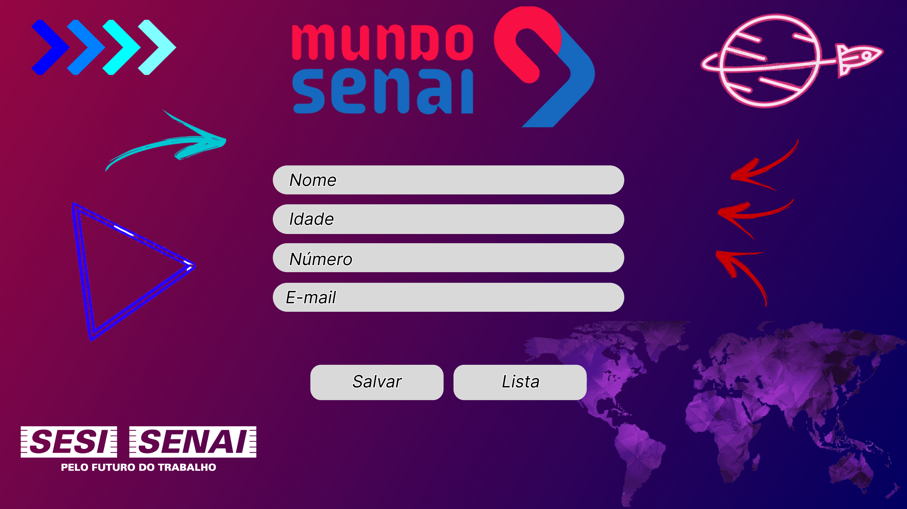

<h1 align="center"> Mundo SENAI 2022 </h1>

Projeto criado com os alunos do Programa de Aprendizagem Industrial em Programação Web para o Evento Mundo SENAI 2022.

  

## 🚀 Tecnologias

Esse projeto foi desenvolvido com as seguintes tecnologias:

- HTML e CSS
- PHP
- MySQL

## 💻 Projeto

O projeto foi desenvolvido para atender a demanda de cadastro de visitantes do evento Mundo SENAI 2022, que acontece em todas as unidades SENAI do Brasil nos dias 08/11 á 10/11.

## 🔖 Layout

Você pode visualizar o layout do projeto através [DESSE LINK](https://www.figma.com/file/jhIxzRVm8QsGftgbGx4jMz/Projeto-Mundo-Senai-PHP). É necessário ter conta no [Figma](https://figma.com) para acessá-lo.

Feito com ♥ pelos alunos :student: :
- Bruna Stangherling :woman_student:
- Júlio Gnoatto :man_student:
- Kauê Gustavo :man_student:
- Luíz Marcomin :man_student:
- Natacha Martins :woman_student:
- Tiago Lankewicz :man_student:

:nerd_face: Sob a tutoria do Professor: Guilherme Pasqualin Algeri :man_teacher: 

Bye ... :wave:
